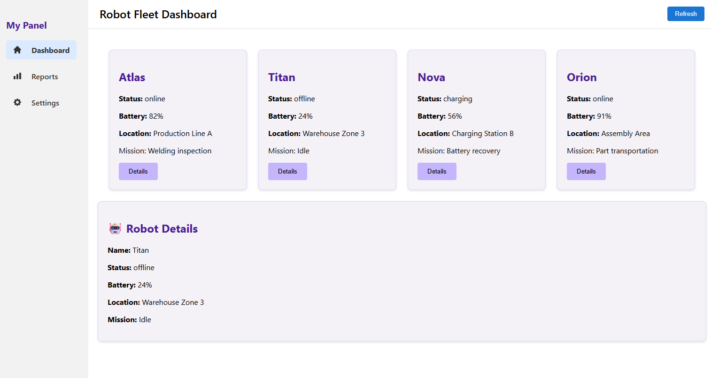

# ** Robot Fleet Dashboard — React**

A simple and clean dashboard built with **React**, **Custom Hooks**, **Routing**, and a fully responsive UI. A robotics-oriented fleet dashboard built with React. The project demonstrates component architecture, custom hooks, context API, routing, shared state management, and reusable UI patterns commonly used in enterprise applications.

---

## 🚀 **Demo**
👉 **https://dashboard-nu-jade-21.vercel.app/**

---
## **🎯 Architecture Highlights**

- Smart and Presentational Component separation
- Context API for shared dashboard settings
- Custom Hooks for reusable business logic
- Component composition
- React Router based navigation
- State lifting and controlled data flow

---

## 📌 **Features**

- Robot Fleet Dashboard
- Robot selection and details view
- Shared settings using Context API
- Dynamic page titles with React Router
- Reports page with robot statistics
- Custom Hooks for reusable business logic
- Reusable RobotCard and RobotDetails components
- Responsive layout
- Sidebar navigation with active state
- Separation of UI and logic

---

## 🧱 **Tech Stack**
- React (JavaScript)
- Context API
- Custom Hooks
- React Router
- React Icons
- CSS (modular component styles)
- Fetch API
- Vercel Deployment

---

## 📂 **Project Structure**
```text
src/
├── components/
│   ├── Header.jsx
│   ├── Sidebar.jsx
│   ├── RobotCard.jsx
│   └── RobotDetails.jsx
│
├── pages/
│   ├── Dashboard.jsx
│   ├── Reports.jsx
│   └── Settings.jsx
│
├── hooks/
│   ├── useFetch.js
│   └── useRobotStats.js
│
├── context/
│   └── DashboardSettingsContext.jsx
│
├── data/
│   └── robots.js
│
├── layout/
│   └── Layout.jsx
│
├── styles/
│
├── App.js
└── index.js

---

## 🛠️ **How to Run Locally**
```bash
git clone https://github.com/Molana2022/dashboard.git
cd dashboard
npm install
npm start
```

---

## 📸 **Screenshot (UI Preview)**


---

## ✔️ **License**
This project is open source and available under the MIT License.

